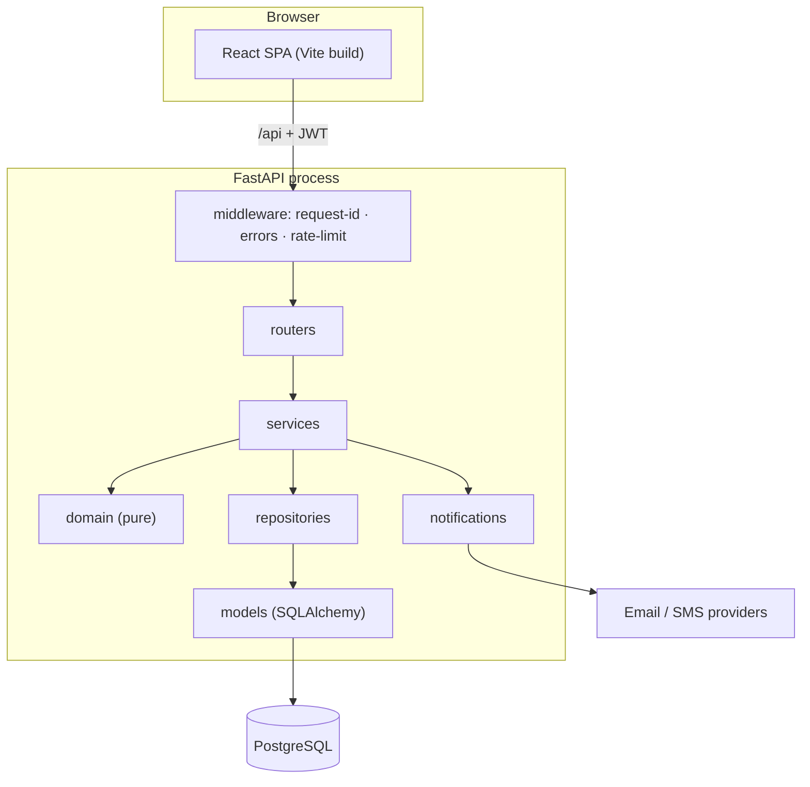
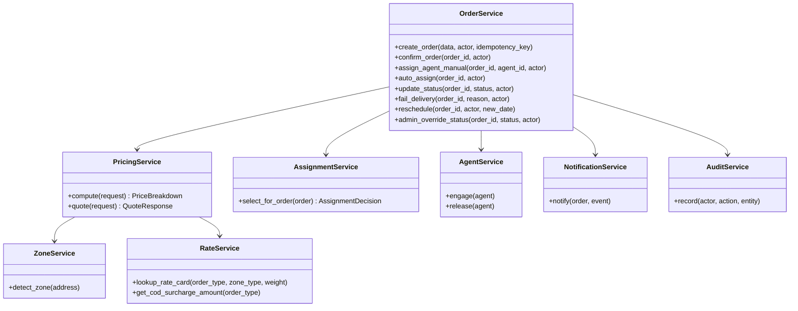
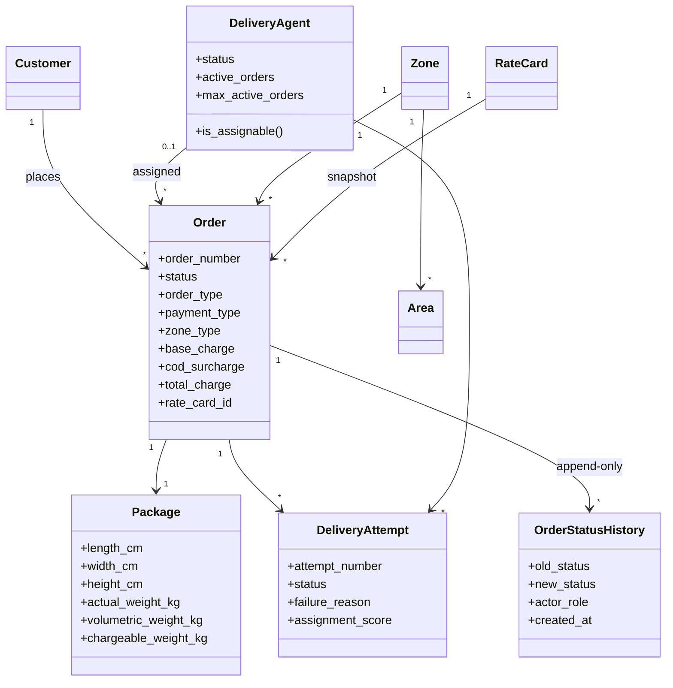
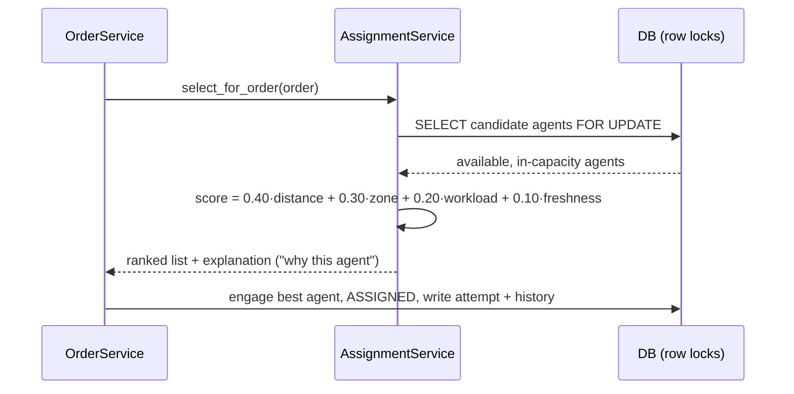
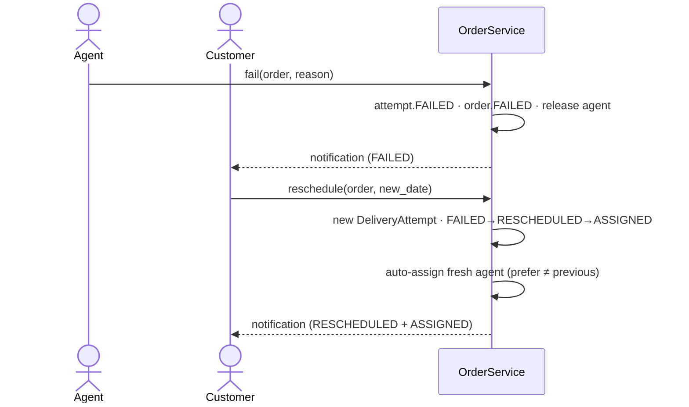

# Architecture

RouteFlow is a **modular monolith**. A single FastAPI application is internally split into clean
layers with strict dependency direction: `routers → services → repositories/domain → models`.

## Layers

```
┌─────────────────────────────────────────────────────────────┐
│ routers/        HTTP endpoints. Thin. Parse, authorize, call │
│                 a service, serialize the result.             │
├─────────────────────────────────────────────────────────────┤
│ services/       Business orchestration & transactions.       │
│                 OrderService, PricingService, AssignmentSvc, │
│                 AgentService, RateService, ZoneService,      │
│                 AnalyticsService, AuditService, AuthService. │
├─────────────────────────────────────────────────────────────┤
│ domain/         Pure logic. No FastAPI, no DB.               │
│                 pricing, zones, state_machine, assignment,   │
│                 geo, enums, errors.                          │
├─────────────────────────────────────────────────────────────┤
│ repositories/   Query objects (OrderRepository: filtering,   │
│                 pagination, eager loading).                  │
├─────────────────────────────────────────────────────────────┤
│ models/         SQLAlchemy ORM (source of truth for schema). │
└─────────────────────────────────────────────────────────────┘
```

Cross-cutting: `core/` (config, database, security, dependencies, rate-limit),
`middleware/` (request-id + structured logging, centralized error handling),
`notifications/` (provider abstraction + dispatch), `utils/` (logging, id generation).

## Why these boundaries

- **Thin routers** keep HTTP concerns (status codes, auth dependencies, serialization) out of
  business logic and make services reusable (e.g. the seeder drives `OrderService` directly).
- **A pure domain layer** isolates the most valuable, most-tested logic from frameworks and the
  database. Every rule that an evaluator cares about — volumetric weight, rate selection, legal
  status transitions, assignment scoring — is a pure function.
- **Repository for orders** centralizes complex, security-sensitive query construction
  (role scoping, pagination, filters) and prevents accidental "load everything" queries.

## Request lifecycle

1. `RequestContextMiddleware` assigns an `X-Request-ID`, binds it (and later the user id) to a
   context variable used by the JSON logger, and logs method/path/status/duration.
2. Auth dependencies (`get_current_user`, `require_roles`, ownership helpers) validate the JWT
   and enforce RBAC **server-side**.
3. The router calls a service. Services own the transaction boundary (`commit`/`rollback`).
4. Domain functions compute results; repositories run queries; models persist.
5. Errors raise typed `AppError`s; a global handler renders a consistent
   `{"error": {code, message, details}}` envelope. Unexpected exceptions are logged with a stack
   trace and returned as an opaque `500` (no leakage).

## Key domain modules

- **`domain/pricing.py`** — volumetric & chargeable weight, `PriceBreakdown`, overlap check.
- **`domain/zones.py`** — address normalization + longest-match area resolution.
- **`domain/state_machine.py`** — the transition table and helpers (`can_transition`, …).
- **`domain/assignment.py`** — weighted scoring (`distance`, `zone`, `workload`, `freshness`)
  producing a ranked, explainable decision.
- **`domain/geo.py`** — Haversine distance.

## Concurrency & consistency

- Agent assignment locks candidate rows (`SELECT … FOR UPDATE`) and re-checks capacity inside the
  transaction, so two concurrent assignments can't exceed capacity.
- Order creation is **idempotent** via a stored `Idempotency-Key`.
- Money is `Numeric`; timestamps are UTC; enums are stored as checked `VARCHAR` for portability.

## Notifications

`NotificationService` builds a message, persists a `Notification` row, then attempts delivery via
a channel provider (`EmailNotificationProvider`, `SMSNotificationProvider`). Any provider failure
is recorded on the row (`status = FAILED`) but **never** propagates — an email outage cannot roll
back an order status change.

## Frontend

A Vite + React **(JavaScript/JSX)** SPA styled with **Tailwind CSS v4**. `AuthContext` holds the
session; TanStack Query manages server state with caching and invalidation; role-based routing
guards each area; a small Tailwind component kit (`components/ui.jsx`) keeps the UI consistent. The
API client attaches the JWT and normalizes the backend error envelope into user-facing toasts.

---

## UML & diagrams

### Component / deployment view



### Class diagram — services (the orchestration brains)



### Class diagram — core domain entities



### Sequence — auto-assignment scoring



### Sequence — failed delivery → reschedule



