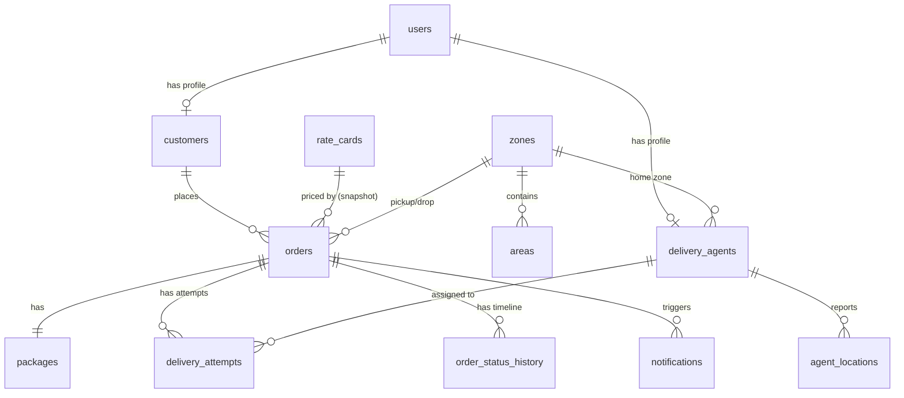

# Database Schema

PostgreSQL, modelled with SQLAlchemy 2.x and migrated with Alembic. Monetary columns use
`Numeric`; timestamps are timezone-aware UTC; enums are stored as `VARCHAR` (portable, checked).

## Entity relationships

## Tables

| Table | Purpose | Notable columns / rules |
|-------|---------|--------------------------|
| `users` | Auth identity | `email` unique, `password_hash` (Argon2), `role` |
| `customers` | Customer profile (1:1 user) | `user_id` unique FK |
| `delivery_agents` | Agent profile (1:1 user) | `status`, `current_zone_id`, lat/lon, `max_active_orders`, `active_orders`; checks on capacity |
| `agent_locations` | Append-only location pings | indexed `(agent_id, recorded_at)` |
| `zones` | Serviceable zones | `code` unique |
| `areas` | Area→Zone mapping | `normalized_name` unique; indexed for detection |
| `rate_cards` | Configurable rates | `(order_type, zone_type, min, max, base_charge)`; checks `max>min`, `base>=0` |
| `cod_surcharges` | COD charge per order type | `order_type` unique |
| `orders` | Order + **price snapshot** | zones/areas, classification, status, `base_charge`, `cod_surcharge`, `total_charge`, `chargeable_weight_kg`, `rate_card_id`, `confirmed_at`, `delivered_at` |
| `packages` | Package per order (1:1) | dims + actual/volumetric/chargeable weight; positivity checks |
| `delivery_attempts` | One row per attempt | `attempt_number` unique per order; `failure_reason`, `assignment_score`, `assignment_metadata` |
| `order_status_history` | **Immutable** timeline | `old_status`, `new_status`, `actor_id`, `actor_role`, `reason`, `metadata`, `created_at` — append-only |
| `notifications` | Notification log | `channel`, `event_type`, `status`, `sent_at`, `failure_reason` |
| `idempotency_keys` | Dedupe order creation | unique `(key, endpoint)` |
| `audit_logs` | Admin action trail | `action`, `entity_type`, `entity_id`, `old_value`, `new_value` |

## Indexes

Optimized for the common access patterns:

- `orders`: `status`, `customer_id`, `assigned_agent_id`, `pickup_zone_id`, `drop_zone_id`,
  `created_at`, unique `order_number`.
- `order_status_history`: `(order_id, created_at)`.
- `delivery_agents`: `status`. `areas`: `normalized_name`, `zone_id`.
- `rate_cards`: `(order_type, zone_type, is_active)` for fast lookup.
- `delivery_attempts`: `order_id`, `agent_id`. `notifications`: `order_id`, `status`.

## Constraints & integrity

- **Foreign keys** everywhere with deliberate `ON DELETE` behavior
  (`RESTRICT` for customers/creators of orders, `CASCADE` for owned children,
  `SET NULL` for optional agent references).
- **Check constraints**: agent capacity `> 0`, `active_orders >= 0`, package dimensions `> 0`,
  actual weight `> 0`, rate `max_weight_kg > min_weight_kg`, `base_charge >= 0`,
  `total_charge >= 0`, `cod_amount >= 0`.
- **Unique constraints**: user email, zone code, area normalized name, COD per order type,
  `(order_id, attempt_number)`, `(idempotency key, endpoint)`.

## Immutability

- `order_status_history` and `agent_locations` are append-only; no service exposes an
  update/delete path for them.
- The order price snapshot is written once at creation and treated as read-only thereafter.
