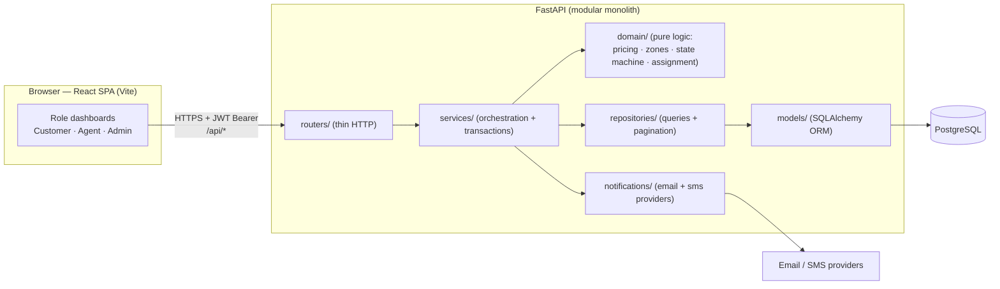
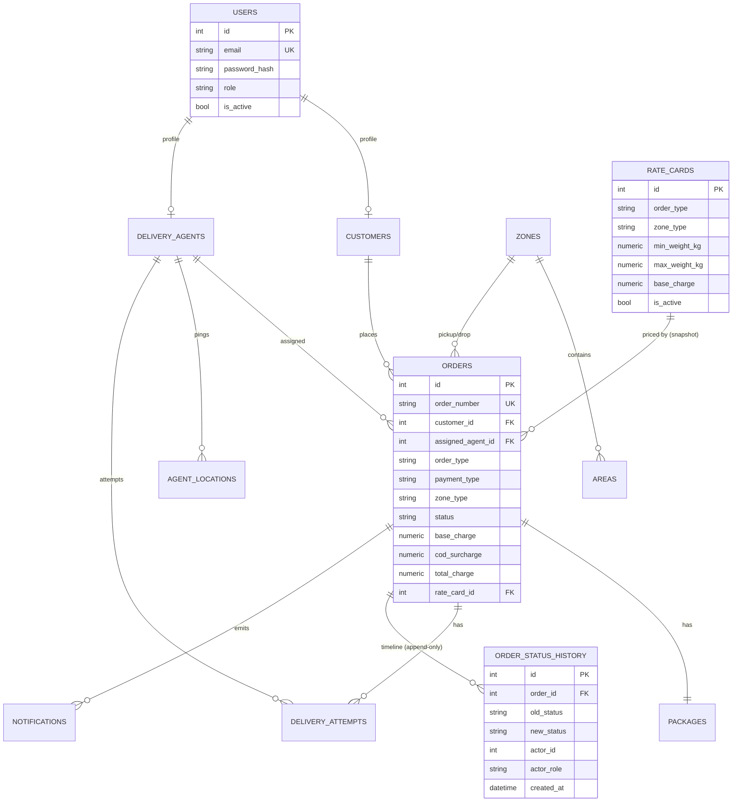
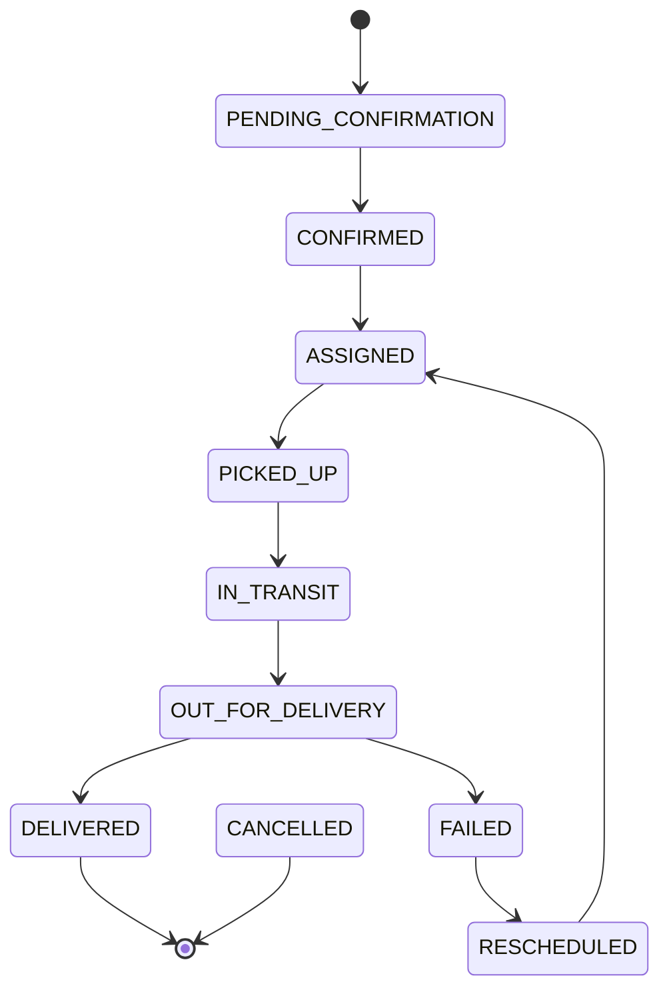
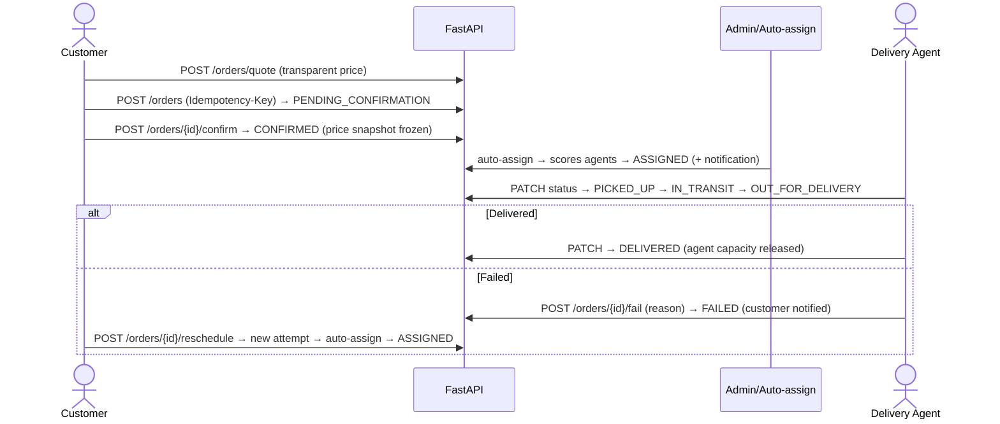

# RouteFlow — Last-Mile Delivery Management Platform

RouteFlow is a production-quality, configurable last-mile delivery platform. It manages the
**complete lifecycle of a delivery order** — from an explainable price quote and automatic zone
detection, through intelligent agent assignment and an immutable status timeline, to a
first-class failed-delivery and reschedule workflow.

Built as a **modular monolith**: a **FastAPI + PostgreSQL** backend and a **React (JavaScript) +
Vite + Tailwind CSS v4** single-page app.

> **New here?** Jump to [Quick start (zero-setup, SQLite)](#quick-start-1--zero-setup-sqlite) to run
> the whole thing in ~2 minutes, or [Deploy a free public demo](#deploy-a-free-public-demo) to put
> it online.

---

## Table of contents

- [Features](#features)
- [Tech stack](#tech-stack)
- [Architecture](#architecture)
- [Repository structure](#repository-structure)
- [Quick start 1 — zero-setup (SQLite)](#quick-start-1--zero-setup-sqlite)
- [Quick start 2 — Docker](#quick-start-2--docker)
- [Local development](#local-development)
- [Environment variables](#environment-variables)
- [Database migrations & seed](#database-migrations--seed)
- [Rate calculation logic](#rate-calculation-logic)
- [Database schema](#database-schema)
- [Order lifecycle](#order-lifecycle)
- [API documentation](#api-documentation)
- [Testing](#testing)
- [Demo credentials](#demo-credentials)
- [Deploy a free public demo](#deploy-a-free-public-demo)
- [Design decisions](#design-decisions)
- [Assumptions](#assumptions)
- [Known limitations](#known-limitations)
- [Future improvements](#future-improvements)

---

## Features

**Core engineering**

- **Configurable rate engine** — no hardcoded rates. Rates are keyed by order type (B2B/B2C),
  zone type (intra/inter) and weight bracket, all admin-managed at runtime.
- **Volumetric weight** — `L×B×H / 5000`; billing uses `max(actual, volumetric)`.
- **Automatic zone detection** — resolves pickup/drop zones from free-text addresses via an
  admin-managed Area→Zone map with normalized, longest-match matching.
- **COD surcharge** — configured per order type; applied only for COD.
- **Explainable pricing** — a full, itemized breakdown is shown before the customer confirms.
- **Immutable price snapshot** — once confirmed, an order's price never changes even if rate
  cards change later.
- **Order status state machine** — a single source of truth rejects invalid transitions.
- **Immutable tracking history** — every status change appends a record (actor, timestamp,
  reason). No deletes.
- **Intelligent auto-assignment** — agents are scored on distance, zone match, workload and
  location freshness (not just "nearest"). The decision and score are stored for audit.
- **Failed-delivery & reschedule** — failure creates a delivery attempt; rescheduling creates a
  *new* attempt and auto-assigns a fresh agent, preserving history.
- **Notifications** — email (always) and SMS (behind an abstraction) on every status change,
  with retry-safe, isolated delivery.
- **RBAC** — `CUSTOMER`, `DELIVERY_AGENT`, `ADMIN`, enforced server-side with ownership checks.
- **Idempotent order creation** via `Idempotency-Key`.
- **Concurrency-safe assignment** using row-level locking.

**Product**

- **Customer** — register/login, quote, create, track (timeline), reschedule, notifications.
- **Agent** — availability, GPS location, assigned deliveries, status updates.
- **Admin** — zones, areas, rate cards, COD, agents, all orders (filter/paginate), manual & auto
  assignment, status override, analytics dashboard with charts.

---

## Tech stack

| Layer | Technology |
|------|------------|
| Frontend | **React 19 (JavaScript/JSX)**, **Vite**, **Tailwind CSS v4** (`@tailwindcss/vite`), React Router, TanStack Query, React Hook Form, Recharts, lucide-react, react-hot-toast |
| Backend | **Python**, **FastAPI**, Pydantic v2, SQLAlchemy 2.x, Alembic |
| Database | **PostgreSQL** in production; portable models also run on **SQLite** for local demos & tests |
| Auth | **JWT** (access + refresh), **Argon2** password hashing |
| Infra | Docker, docker-compose, Nginx (frontend image) |

---

## Architecture

RouteFlow is a modular monolith with strict layer boundaries: `routers → services →
domain/repositories → models`. The most valuable logic (pricing, zones, state machine, assignment)
lives in a **pure, framework-free `domain/` layer** that is unit-tested in isolation.



Deep dives: [ARCHITECTURE.md](ARCHITECTURE.md) · [DATABASE.md](DATABASE.md) ·
[RATE_CALCULATION.md](RATE_CALCULATION.md) · [API.md](API.md) · [SYSTEM_DESIGN.md](SYSTEM_DESIGN.md)
· [DEPLOYMENT.md](DEPLOYMENT.md).

---

## Repository structure

```
.
├── backend/                 FastAPI app, tests, alembic, seed
│   ├── app/
│   │   ├── core/            config, db, security, deps, rate limiting
│   │   ├── domain/          pure logic: enums, errors, pricing, zones, state_machine, assignment, geo
│   │   ├── models/          SQLAlchemy ORM models
│   │   ├── schemas/         Pydantic request/response models
│   │   ├── repositories/    query objects (order listing/pagination)
│   │   ├── services/        business orchestration
│   │   ├── routers/         HTTP endpoints
│   │   ├── notifications/   provider abstraction + dispatch service
│   │   ├── middleware/      request context + centralized error handling
│   │   ├── seeds/           demo data
│   │   └── main.py          app factory + wiring
│   ├── tests/               unit (pure domain) + integration (API) tests
│   ├── alembic/             migrations
│   ├── run.py               dev launcher (anchors cwd; reads .env)
│   └── requirements.txt
├── frontend/                React + Vite SPA (JavaScript)
│   ├── src/
│   │   ├── lib/             api client, axios wrapper, formatters, constants
│   │   ├── context/         AuthContext (session)
│   │   ├── components/      ui kit + Layout
│   │   └── pages/           auth · customer · agent · admin · shared
│   ├── vite.config.js       Tailwind v4 plugin + @ alias + /api proxy
│   └── package.json
├── docker-compose.yml
├── render.yaml              one-click backend blueprint (Render)
└── README · ARCHITECTURE · API · DATABASE · RATE_CALCULATION · SYSTEM_DESIGN · DEPLOYMENT (.md)
```

---

## Quick start 1 — zero-setup (SQLite)

The fastest way to see the whole app. No database server required — the backend uses a local
SQLite file, seeded with demo data.

**Backend** (terminal 1):

```bash
cd backend
python -m venv .venv
# Windows: .venv\Scripts\activate     macOS/Linux: source .venv/bin/activate
pip install -r requirements.txt

# The committed backend/.env already sets DATABASE_URL=sqlite:///./demo.db
python -m app.seeds.seed      # builds demo.db + prints demo credentials
python run.py                 # serves http://localhost:8000  (Swagger at /docs)
```

**Frontend** (terminal 2):

```bash
cd frontend
npm install
npm run dev                   # serves http://localhost:5173  (proxies /api → :8000)
```

Open <http://localhost:5173> and use a one-click demo login. Done.

---

## Quick start 2 — Docker

Prerequisites: Docker + Docker Compose. This runs **PostgreSQL**, applies migrations, seeds demo
data, and serves the SPA + API.

```bash
cp .env.example .env          # adjust JWT_SECRET etc.
docker compose up --build
```

- Frontend: <http://localhost:5173>
- API + Swagger: <http://localhost:8000/docs>
- Health: <http://localhost:8000/health>

---

## Local development

### Backend (with PostgreSQL)

```bash
cd backend
python -m venv .venv && source .venv/bin/activate   # or .venv\Scripts\activate on Windows
pip install -r requirements.txt

cp .env.example .env          # set DATABASE_URL to your Postgres, JWT_SECRET, etc.
alembic upgrade head          # apply schema
python -m app.seeds.seed      # demo data + credentials
uvicorn app.main:app --reload # or: python run.py
```

> The ORM models are portable, so the **test-suite runs on in-memory SQLite** with no Postgres.

### Frontend

```bash
cd frontend
npm install
cp .env.example .env          # optional; defaults work with the dev proxy
npm run dev
```

The dev server proxies `/api` to `http://localhost:8000` (override with `VITE_PROXY_TARGET`), so
no CORS setup is needed locally.

---

## Environment variables

Backend — see [`backend/.env.example`](backend/.env.example):

| Variable | Description |
|---------|-------------|
| `DATABASE_URL` | SQLAlchemy URL. `sqlite:///./demo.db` (local) or `postgresql+psycopg2://…` (prod) |
| `JWT_SECRET` | Signing secret — generate a long random value |
| `JWT_EXPIRATION_MINUTES` | Access-token lifetime (default 1440) |
| `CORS_ORIGINS` | Comma-separated allowed origins (e.g. your Vercel URL) |
| `EMAIL_PROVIDER` | `console` (logs) or `smtp` |
| `SMS_ENABLED` / `SMS_PROVIDER` | SMS is optional; the app works without credentials |
| `VOLUMETRIC_DIVISOR` | Default `5000` |
| `RATE_LIMIT_PER_MINUTE` | Global rate limit (default 120) |

Frontend — see [`frontend/.env.example`](frontend/.env.example):

| Variable | Description |
|---------|-------------|
| `VITE_API_BASE_URL` | API base. Local: `/api` (proxied). Prod: `https://<backend>/api` |
| `VITE_PROXY_TARGET` | Dev-only proxy target (default `http://localhost:8000`) |

No secrets are committed. `.env` and `*.db` are git-ignored.

---

## Database migrations & seed

```bash
alembic upgrade head                              # apply schema
alembic revision --autogenerate -m "message"      # create a new migration
python -m app.seeds.seed                          # idempotent demo data
```

---

## Rate calculation logic

Pricing is **fully admin-configurable** — nothing is hardcoded. Full detail in
[RATE_CALCULATION.md](RATE_CALCULATION.md). The pipeline:

1. **Detect zones** from the pickup & drop addresses (Area→Zone map).
2. **Zone type** = `INTRA_ZONE` if pickup zone == drop zone, else `INTER_ZONE`.
3. **Volumetric weight** `= (L × B × H) / 5000` (cm → kg).
4. **Chargeable weight** `= max(actual_weight, volumetric_weight)`.
5. **Rate lookup** — pick the active rate card for `(order_type, zone_type)` whose **half-open
   `(min, max]`** weight bracket contains the chargeable weight.
6. **COD surcharge** — add the configured per-order-type surcharge (prepaid = 0).
7. **Total** `= base_charge + cod_surcharge`. Money is `Decimal` end-to-end.

**Worked example** — parcel `50 × 40 × 30 cm`, actual `8 kg`, B2C, COD:

```
volumetric = 50 × 40 × 30 / 5000 = 12 kg
chargeable = max(8, 12)          = 12 kg     → bill on 12 kg
base_charge = B2C · <zone type> · bracket containing 12 kg   (from the rate card)
cod_surcharge = configured B2C COD surcharge
total = base_charge + cod_surcharge
```

The quote endpoint returns every line so the UI can show a transparent breakdown **before** the
customer confirms. On confirmation the `base/cod/total/chargeable_weight/rate_card_id` are
**snapshotted onto the order**, so later rate-card edits never change historical bills.

---

## Database schema

Normalized schema with primary/foreign keys, unique & check constraints, and indexes on hot paths.
`Numeric` for money, UTC timestamps, enums stored as checked `VARCHAR` (portable to SQLite). Full
detail in [DATABASE.md](DATABASE.md).



---

## Order lifecycle

A single transition table (`domain/state_machine`) is the source of truth. Illegal transitions are
rejected everywhere; admins have a *controlled*, audited override.



Happy path + failure/reschedule as a sequence:



---

## API documentation

Interactive **OpenAPI/Swagger UI** at **`/docs`** and **ReDoc** at **`/redoc`**. A curated
endpoint reference (with roles and examples) is in [API.md](API.md). Endpoint groups:

| Group | Prefix | Example |
|------|--------|---------|
| Auth | `/api/auth` | `POST /login`, `POST /register`, `GET /me` |
| Orders | `/api/orders` | `POST /quote`, `POST /`, `POST /{id}/confirm`, `POST /{id}/reschedule`, `PATCH /{id}/status`, `POST /{id}/fail` |
| Tracking | `/api/tracking` | `GET /{id}`, `GET /{id}/timeline` |
| Agents | `/api/agents` | `GET /me`, `PATCH /me/availability`, `PATCH /me/location` |
| Admin | `/api/admin` | zones, areas, rates, cod-surcharges, agents, orders, `assign`, `auto-assign`, `override` |
| Analytics | `/api/analytics` | `GET /summary` |
| Notifications | `/api/notifications` | `GET /` |

All error responses share one envelope: `{"error": {"code", "message", "details?"}}`.

---

## Testing

```bash
cd backend
pytest                        # unit + integration (in-memory SQLite)
pytest tests/unit             # pure domain logic
pytest --cov=app              # with coverage
```

Unit tests cover the rate engine (volumetric/chargeable weight, B2B/B2C, intra/inter, COD,
boundary weights, overlap detection), zone detection, the full state-machine transition table and
assignment scoring. Integration tests cover auth/RBAC, the end-to-end order lifecycle,
price-snapshot immutability, idempotency, and the fail→reschedule workflow.

---

## Demo credentials

All demo accounts share the password **`Password123!`**.

| Role | Email |
|------|-------|
| Admin | `admin@routeflow.app` |
| Customer | `customer@routeflow.app` |
| Delivery Agent | `agent@routeflow.app` |

The login screen has one-click demo buttons for each role.

---

## Deploy a free public demo

Full step-by-step instructions for a brand-new person are in **[DEPLOYMENT.md](DEPLOYMENT.md)**.
The recommended 100%-free stack:

| Piece | Host | Free tier |
|------|------|-----------|
| Database | **Neon** | Free serverless Postgres |
| Backend API | **Render** | Free web service (`render.yaml` blueprint included) |
| Frontend SPA | **Vercel** | Free static hosting (`frontend/vercel.json` included) |

At a glance:

1. **Neon** → create a project, copy the `postgresql://…?sslmode=require` connection string.
2. **Render** → New Web Service from this repo, root `backend/`, build
   `pip install -r requirements.txt`, start
   `alembic upgrade head && python -m app.seeds.seed && uvicorn app.main:app --host 0.0.0.0 --port $PORT`.
   Set `DATABASE_URL`, `JWT_SECRET`, `CORS_ORIGINS`. Or click **Deploy** with the bundled
   `render.yaml`.
3. **Vercel** → import the repo, root `frontend/`, set `VITE_API_BASE_URL=https://<render-app>/api`.
   The included `vercel.json` handles SPA deep-linking.
4. Point the backend's `CORS_ORIGINS` at your Vercel URL and redeploy.

See [DEPLOYMENT.md](DEPLOYMENT.md) for screenshots-level detail, troubleshooting, and how to verify.

---

## Design decisions

1. **Modular monolith over microservices** — cohesive, deployable, clean layer boundaries (no
   Kubernetes / distributed systems).
2. **Pure domain layer** — pricing, zones, state machine and assignment are framework- and DB-free,
   making the highest-value logic trivially unit-testable.
3. **Immutable price snapshot** — pricing fields are copied onto the order at creation.
4. **Append-only tracking** — no update/delete path for `order_status_history`.
5. **`Decimal`/`Numeric` for money** — never floats.
6. **Portable enums** (`native_enum=False`) — one model layer runs on Postgres and SQLite.
7. **Isolated notifications** — a provider failure is recorded but never rolls back an order.
8. **Row-locked assignment** — capacity re-checked inside a locked transaction.

## Assumptions

- Zone detection uses an admin-managed Area→Zone map (geocoding is stubbed behind a flag).
- One package per order (dimensions + weight captured on the order).
- Distance uses Haversine on reported agent coordinates; missing coordinates fall back to a
  neutral score.
- Currency is INR throughout the demo.
- Reschedule is capped (`MAX_RESCHEDULE_ATTEMPTS`, default 3).

## Known limitations

- Live tracking uses polling (TanStack Query) rather than WebSockets.
- Admin status override intentionally bypasses the state machine (audited) and does not re-engage
  agent capacity for unusual backward transitions.
- Email/SMS default to a console provider in development.

## Future improvements

- WebSocket live agent tracking on a map.
- Refresh-token rotation & revocation list.
- Route optimization / batching across multiple orders.
- Multi-currency and tax support.
- Background worker (queue) for notification retries.
