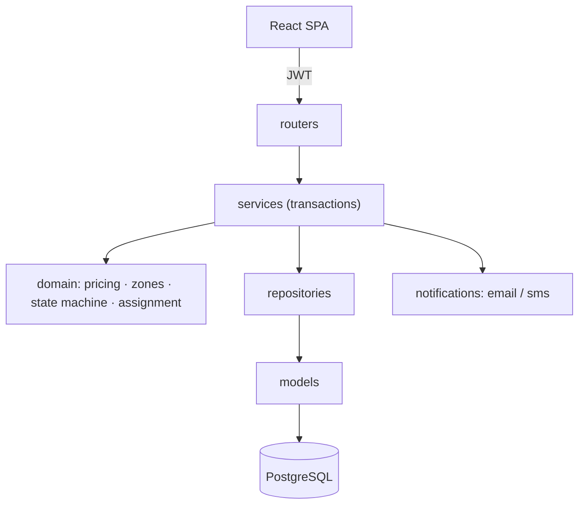

# System Design

RouteFlow is a modular monolith (FastAPI + PostgreSQL + React). A single app is split into
strict layers — routers → services → domain/repositories → models — so business rules stay
framework- and database-independent and are unit-tested in isolation. This document explains the
*decisions* behind the core subsystems.

## Rate calculation engine

Pricing is fully admin-configurable; nothing is hardcoded. The pure functions in `domain/pricing`
compute volumetric weight (`L×B×H/5000`) and chargeable weight (`max(actual, volumetric)`). The
service resolves zones, derives `zone_type` (intra vs inter), then selects the active rate card
for `(order_type, zone_type)` whose weight bracket contains the chargeable weight. Brackets are
**half-open `(min, max]`**, which makes boundary weights deterministic (they fall into the lower
bracket) and guarantees non-overlap — enforced again at configuration time. COD adds a per-order-
type surcharge (prepaid = 0). Money is `Decimal` end-to-end. Crucially, the computed
`base/cod/total/chargeable_weight/rate_card_id` are **snapshotted onto the order** at creation, so
later rate edits never rewrite historical billing. This is the single most important correctness
guarantee and is covered by an integration test.

## Zone detection

The base implementation resolves zones from free-text addresses using an admin-managed Area→Zone
map. Address text is normalized (lower-cased, punctuation removed, whitespace collapsed) and
matched against active area names, preferring the **longest** match so specific areas win over
generic prefixes. Unmatched addresses return a clear `ZONE_NOT_FOUND` rather than a guess.
Geocoding (Nominatim) sits behind a feature flag for future precision without changing callers.

## Auto-assignment logic

Assignment never blindly picks the nearest agent. `domain/assignment` scores each candidate on a
weighted blend: **distance 0.40, zone match 0.30, workload 0.20, freshness 0.10**. Distance uses
Haversine on reported coordinates (neutral when missing); workload favors free capacity; freshness
decays with the age of the last location ping. The engine returns a ranked list with a
human-readable explanation and a full breakdown, which is stored on the delivery attempt for
audit ("why this agent?"). Ties break deterministically for reproducibility.

## Agent availability & concurrency

An agent is assignable only when `is_active`, `status = AVAILABLE`, and `active_orders <
max_active_orders`. Assignment locks candidate rows with `SELECT … FOR UPDATE` and re-checks
capacity inside the transaction, so two concurrent assignments cannot exceed capacity. Engaging an
order increments `active_orders` (flipping to `BUSY` at capacity); delivery/failure/cancellation
releases it (flipping back to `AVAILABLE`).

## Order state machine

A single transition table (`domain/state_machine`) is the source of truth:
`PENDING_CONFIRMATION → CONFIRMED → ASSIGNED → PICKED_UP → IN_TRANSIT → OUT_FOR_DELIVERY →
DELIVERED`, with `OUT_FOR_DELIVERY → FAILED → RESCHEDULED → ASSIGNED`. Illegal transitions are
rejected everywhere. Admins have a *controlled* override that bypasses the table but still records
history and an audit entry.

## Immutable tracking history

Every status change appends a row to `order_status_history` (old/new status, actor, role, reason,
metadata, timestamp). No service exposes an update or delete path — the timeline is append-only,
giving customers a trustworthy, complete history and satisfying auditability.

## Failed delivery handling

Failure is first-class. Marking a delivery failed records the reason on the current attempt,
transitions the order to `FAILED`, releases the agent, and notifies the customer. Rescheduling
creates a **new** `delivery_attempt` (preserving prior attempts), transitions
`FAILED → RESCHEDULED → ASSIGNED`, and auto-assigns a fresh agent — preferring one other than the
agent who failed. Attempts are capped to prevent abuse.

## Notification architecture

`NotificationService` persists a `Notification` row, then dispatches through channel providers
(`Email` always, `SMS` behind an abstraction and disabled by default). Delivery is **isolated**:
provider failures are recorded (`status = FAILED`) but never propagate, so a notification outage
cannot roll back an order state change. Records enable retry and observability.

## Database design

Normalized schema with FKs, unique and check constraints, and indexes tuned for hot paths
(`orders.status/customer/agent/zones/created_at`, `order_status_history(order_id, created_at)`,
`rate_cards(order_type, zone_type, is_active)`). `Numeric` for money, UTC timestamps, and enums
stored as checked `VARCHAR` (which also keeps the model portable to SQLite for fast tests).

## Scalability considerations

The monolith scales horizontally behind a load balancer (JWT auth is stateless). Read-heavy
admin/analytics endpoints are server-side paginated and filtered — never load-all. Connection
pooling is configured; the assignment hot path is a bounded, indexed query with row locks. Natural
next steps: move notification dispatch to a background queue with retries, add read replicas for
analytics, introduce Redis for rate-limiting/caching, and add WebSocket live tracking — none of
which require breaking the modular boundaries already in place.
